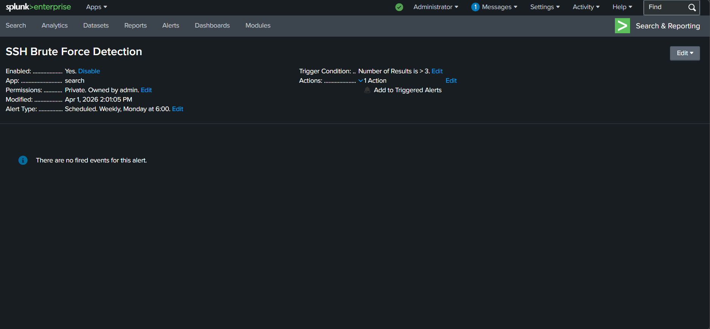

# 🔐 SOC Lab - SSH Brute Force Detection using Splunk

## 📌 Objective
This project simulates a real-world SSH brute-force attack and demonstrates how it can be detected using Splunk SIEM.

---

## 🛠️ Tools Used
- Splunk (SIEM)
- Kali Linux
- Nmap
- SSH

---

## ⚔️ Attack Simulation
- Performed port scanning using Nmap  
- Simulated brute-force login attempts via SSH  
- Generated multiple failed authentication logs  

---

## 🔍 Log Analysis & Detection
- Collected logs using `journalctl`  
- Uploaded logs into Splunk  
- Used SPL queries to detect suspicious activity  

### 🔎 Detection Query

---

## 🚨 Alert Creation
- Created alert in Splunk for brute-force detection  
- Trigger condition: More than 3 failed attempts  
- Action: Added to triggered alerts  

---

##  Screenshots

### 🔹 Attack Simulation

### 🔹 Failed Login Attempts

### 🔹 Splunk Detection

### 🔹 Alert Created

---

## ✅ Outcome
Successfully simulated a real-world SSH brute-force attack and detected it using SIEM, demonstrating practical SOC analyst skills.

---

##  Skills Gained
- Log Analysis  
- SIEM (Splunk)  
- Threat Detection  
- Incident Monitoring  
- Alert Creation  
